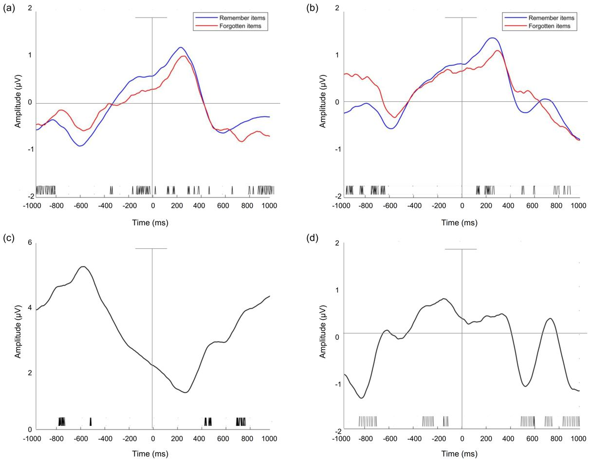

# Memory Classification

## Requirements
Python 3 

* pytorch == 1.10.2
* numpy >= 1.17.5 
* scipy >= 1.1.0 
* scikit-learn >= 0.22.2
* matplotlib 
* tensorboard
* scipy
* mne

## Results
* Memory task Paradigm

* Memory task results

* Difference between conditions of EEG signals during pre on-going stimulus 

* ERP at Cz over all subjects for a) encoding  and b)decoding task. dGFP was calculated for all channels for c) encoding and d) decoding task

